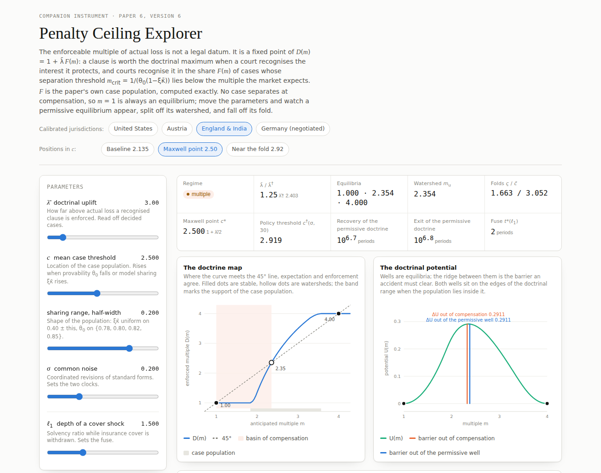

# Penalty Ceiling Explorer

Interactive companion to **Doctrine as a Fixed Point: A Formal Model of the Enforceable Penalty
Ceiling when Human Oversight of AI Must Remain Effective** (Andreas Bauer, working paper,
version 6, September 2026).

**Open it:** <https://tafew.github.io/doctrine-fixed-point/>



## What it shows

The enforceable multiple of actual loss is a fixed point of the doctrine map
D(m) = 1 + λ̄ F(m). A clause is enforced at the doctrinal maximum when a court recognises the
interest it protects, and courts recognise it in the share F(m) of cases whose separation
threshold m_crit = 1/(θ₀(1 − ξκ̄)) lies below the multiple the market expects. F is the paper's
case population, computed exactly: θ₀ equiprobable on {0.78, 0.80, 0.82, 0.85}, ξκ̄ uniform on
0.40 ± h, shifted so that its mean is c.

Five sliders (λ̄, c, h, σ, ℓ₁), four calibrated jurisdictions and three positions in c. The
readout gives the regime, λ̄/λ̄†, the equilibria, the watershed, the folds, the Maxwell point,
the policy threshold c†(σ, 30), the recovery and exit times of the permissive doctrine and the
fuse t*(ℓ₁). Four charts: the doctrine map, the doctrinal potential, the fold in c and the fuse.

The page opens at England and India (λ̄ = 3) at the Maxwell point c = 2.5, with h = 0.20,
σ = 0.20 and ℓ₁ = 1.50: the case in which both wells are equally deep (barrier 0.2911 each).
The paper's baseline, c = 2.1349, is one click away.

## What it is not

The page is a companion, not the source of record. Every number in the paper comes from
`population.py`, `make_doctrine.py` and `make_stochastic.py` in the replication package,
[doi:10.6084/m9.figshare.33212916](https://doi.org/10.6084/m9.figshare.33212916). The version 6
package goes into that record as a new version; its versions 1-2 hold the package of the August
2026 working paper, whose numbers differ.

## Verification

`verify/verify_explorer.py` runs the page in headless Chromium, calls the page's own functions
and compares 44 values with the result files of the version 6 replication package, among them
the fixed points for England, Germany, Austria, λ̄ = 2 and two narrower sharing ranges, λ̄†,
both folds, the Maxwell point, both barriers, the recovery and exit times, c†(σ, 30) at three noise levels and
the fuse at eight shock depths. Twelve further checks read the page as it opens (pressed
presets, slider values, readout) and compare the readout with an independent Python
computation from the package's `code/population.py`.

```
pip install playwright numpy scipy
python -m playwright install chromium
python verify/verify_explorer.py --package /path/to/unpacked/replication/package
python verify/verify_explorer.py --package /path/to/package --url https://tafew.github.io/doctrine-fixed-point/
```

Last run, 23 September 2026: 56 of 56 checks agree (`verify/explorer_check.json`).

## Files

```
index.html                  the explorer: one self-contained page, no libraries, no data files
verify/verify_explorer.py   the check described above
verify/explorer_check.json  its last result
preview.png                 the page as it opens
```

## Licence

[CC BY 4.0](https://creativecommons.org/licenses/by/4.0/), the licence of the replication
package.
